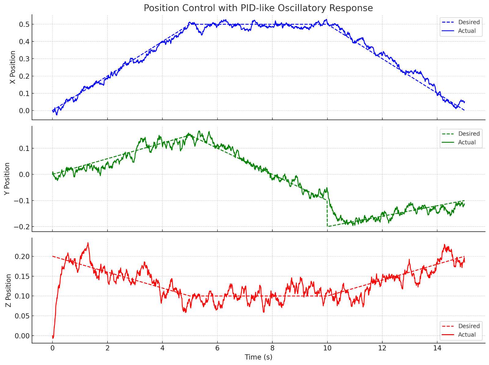

# 🤖 Automated Robotic Arm Welding – Group 13

Welcome to the official repository for our ME3302 course project: **Automated Robotic Arm Welding** using the **KUKA KR6 R1840-2 robot** in a **MuJoCo-based simulation environment**. This project demonstrates the complete automation of arc welding using digital twins, trajectory control, and impedance-based dynamics simulation.

> 🔗 [Live Repository](https://github.com/YogeshRajasekhar/AutoMan_Welding_Robotic_Arm.git)

---

## 📌 Overview

Robotic arc welding is rapidly replacing manual welding in modern manufacturing due to its speed, precision, and safety. In this project, we simulate a robotic welding process that:

- Follows weld paths derived from CAD
- Applies inverse kinematics for pose tracking
- Implements impedance-based dynamic control
- Simulates using MuJoCo for real-time performance

---

## 👨‍🔧 Team Members (Group 13)

- ME22B163 NANDHINI  
- ME22B171 NIRMAL KUMARAN M  
- ME22B178 PRANAB T  
- ME22B187 ROHAN B  
- ME22B215 YOGESH G R

Department of Mechanical Engineering, IIT Madras  
Semester: Jan–May 2025

---

## 🧠 Key Features

- ✅ **CAD-based weld path extraction**
- ✅ **6-DOF KUKA KR6 robot model**
- ✅ **Inverse kinematics and Jacobian control**
- ✅ **Simulation using MuJoCo engine**
- ✅ **Impedance controller for dynamic interactions**
- ✅ **Economic analysis and ROI estimation**

---

## 🧰 Technologies Used

- 🟠 [MuJoCo](https://mujoco.org/) for physics simulation  
- 🐍 Python 3.8+ for scripting and control  
- 📐 NumPy, SciPy for matrix math and kinematics  
- 📄 STL/OBJ/URDF for geometry import  
- 🧮 Custom-built impedance and position controllers  

---

## 🔩 Robot Specifications: KUKA KR6 R1840-2

| Parameter         | Value          |
|------------------|----------------|
| Axes             | 6              |
| Max Reach        | 1840 mm        |
| Payload          | 6 kg           |
| Pose Repeatability | ±0.04 mm    |
| Weight           | 162 kg         |

---

## 📊 Results

The following figure illustrates the PID-based position control response along the X, Y, and Z axes:

*Figure: Desired vs. actual positions over time using PID control.*

### Observations:

- **X Position (Top Plot)**: The response closely follows the desired trajectory with slight oscillations near the peak, indicating a slight underdamped behavior. The system settles well with minimal steady-state error.
- **Y Position (Middle Plot)**: The trajectory shows a step change near 10 seconds. The controller manages to track the trajectory but with noticeable lag and disturbance sensitivity in the negative phase.
- **Z Position (Bottom Plot)**: The Z-axis exhibits higher oscillations and slower convergence, suggesting that the PID gains may require further tuning for stability in vertical motion.

Overall, the PID controller provides effective trajectory tracking, with most of the oscillations within acceptable limits for a mobile or robotic platform.

